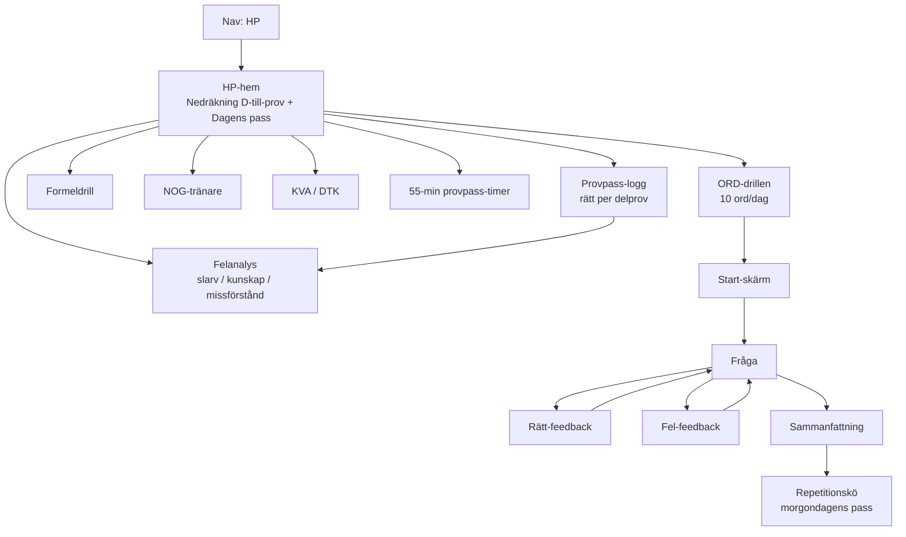

# HP-flik — UX-spec (Högskoleprovet, 18 okt 2026)

_Skapad: 2026-09-24. Status: förslag, väntar på Martins beslut på öppna frågor nedan._

Denna spec beskriver en ny huvudflik "HP" i appen, byggd från grunden inom befintligt designsystem (`docs/DESIGN.md`). Första skärmen som byggs — och testmiljön för hela HP-designspråket — är **ORD-drillen**.

---

## 1. Mål och principer

1. **Tempo är produkten, inte bara innehållet.** Störst research-fynd: tidsbrist är HP:s huvudproblem. Varje ORD-fråga visar målsnitt (~20 s/uppgift) och faktisk tid, så användaren tränar rätt hastighet — inte bara rätt svar. _(Motivering: feedback om prestation mot en tydlig norm förbättrar självreglering — "knowledge of results".)_
2. **Fel svar är input, inte ett nederlag.** Ingen minuspoäng på riktiga HP — så inte heller här. Fel ord läggs automatiskt i en repetitionskö istället för att straffas. _(Motivering: spaced repetition — ord man missar behöver fler exponeringar, inte skam.)_
3. **En tydlig nästa-handling åt gången.** ADHD-anpassning: skärmen visar alltid exakt en primär knapp/åtgärd. Inga parallella vägval mitt i en drill. _(Motivering: val-överbelastning ökar avhopp hos användare med exekutiva svårigheter.)_
4. **Kort och dagligt slår långt och sällan.** ORD-drillen är hårt avgränsad till 10 ord/pass (~3–4 min), inte ett öppet slut. Fler pass går att köra, men varje pass har ett tydligt slut. _(Motivering: research-fyndet "kort daglig drill > långa pass"; korta avgränsade uppgifter sänker startfriktion.)_
5. **Synlig progress hela tiden.** Var i passet man är (t.ex. "ord 4/10"), dagens streak och hur många repetitions-ord som väntar — alltid synligt, aldrig gömt bakom en meny. _(Motivering: extern progressindikator kompenserar för tidsblindhet.)_
6. **Felanalys är värdefullare än poäng.** Varje sammanfattning kategoriserar fel (slarv / kunskap / missförstånd) i stället för att bara visa procent. _(Motivering: research-fyndet att felanalys ger mest lärandeeffekt av allt som testats.)_

---

## 2. Informationsarkitektur — HP-fliken

HP-fliken läggs som en egen post i `pageLabels` / nav-dropdown, jämte Hem/Träna/Prov (samma nav-pill-mönster, se `src/main.ts` `renderNavDropdown`). HP-hem är landningsvyn och länkar vidare till varje delskärm — ingen egen sub-nav, för att undvika ännu en navigeringsnivå ovanpå den redan lappade strukturen.

---

## 3. Skärm för skärm

### 3.1 ORD-drillen (detaljerad)

Datamodell kan följa samma mönster som befintlig `VRSession`/`LSSession` i `src/main.ts` (currentIndex, userAnswer, showFeedback, correct, wrong) — inget nytt sessionskoncept behövs, bara ett nytt ordregister.

**Tillstånd 1 — Start**
- Rubrik: "10 ord idag" + antal ord som väntar i repetitionskön (om >0, visas som egen rad: "+3 repetitionsord från igår").
- En primärknapp: "Starta" (36px action-pill, gradient-primary).
- Ingen konfiguration synlig här — inga val att göra, per princip 3.

**Tillstånd 2 — Fråga**
- Progress: "Ord 4/10" + tunn progress-pip-rad (samma mönster som befintliga track-progress-pips, `--surface-highest`).
- Ordet + 4 svarsalternativ (motsvarar mcq-formatet i `Question`-typen) som fullbredds-knappar, ej pills — samma stil som befintliga mcq-alternativ i bank/mock-vyerna.
- Diskret tempo-indikator: liten klocka/sekundräknare som räknar uppåt mot 20 s-målet (ej nedräkning — nedräkning stressar, uppräkning mot ett riktmärke informerar). Ingen hård timeout.
- Ingen "gissa senare"-knapp — uppmuntrar gissning enligt princip 2 (ingen minuspoäng-koncept ska synas i UI:t: inget "0/1 poäng", bara rätt/fel).

**Tillstånd 3a — Rätt**
- Kort grön (`--ok`) inline-feedback ovanför alternativen, ingen modal, ingen blockering av flödet.
- Alternativet som valdes får `--accent-soft`-bakgrund.
- Auto-advance efter kort delay ELLER en enda "Nästa"-knapp (öppen fråga till Martin, se §6).

**Tillstånd 3b — Fel**
- Samma position, men `--danger`-ton, visar rätt svar direkt under (ingen separat "visa facit"-klick).
- Ordet flaggas tyst för repetitionskön — ingen extra dialog, ingen "vill du öva igen"-fråga (låg friktion).

**Tillstånd 4 — Sammanfattning**
- Stat-widget-mönster (samma som befintliga Score/Streak-siffror): antal rätt av 10, snitt-tempo (t.ex. "18 s/ord — under målet ✓").
- Lista över missade ord, taggade med felkategori om det går att härleda automatiskt (annars manuell taggning som separat läge, se felanalys-skärmen nedan).
- En primärknapp: "Klart för idag" → tillbaka till HP-hem. Ingen "kör igen"-knapp som konkurrerar (håll en tydlig nästa-handling; att köra ett nytt pass är en åtgärd från HP-hem, inte här).

**Tillstånd 5 — Repetition**
- Missade ord dyker upp i morgondagens pass, blandade in bland de 10 nya orden (inte som ett separat "repetitionspass") — lägre friktion, känns inte som straff.
- Om samma ord missas igen: stannar kvar i kön längre (enkel spaced repetition, ingen algoritm-komplexitet i v1).

### 3.2 Övriga skärmar (en rad var, väntar på egen spec)

- **Nedräkning + dagens pass** — HP-hem: "D-24 till HP" + ett kort med dagens föreslagna delmoment (samma logik som `planner.ts`s dagliga plan, men HP-fokuserad).
- **Formeldrill** — samma drillmotor som ORD (fråga → svar → feedback → repetition), bara annat innehåll (formler i stället för ord).
- **NOG-tränare** — flervalsformat men med NOG:s tre-svarsalternativ-logik (tillräcklig info I / II / båda / varken eller) — avviker från standard-mcq, egen komponent.
- **KVA/DTK** — läsförståelse/diagramtolkning, längre uppgifter, troligen kräver bildstöd — ej samma tempo-modell som ORD.
- **Provpass-logg** — tabell/lista: pass-datum, delprov, antal rätt — återanvänder kort-listmönster från befintlig Prov-historik.
- **Felanalys** — aggregat över alla drillar: fördelning slarv/kunskap/missförstånd, filtrerbar per delprov.
- **55-min timer** — fristående verktyg, countdown-widget, troligen egen enkel skärm utan koppling till frågedata.

---

## 4. Komponenter: återanvänt vs nytt

**Återanvänds direkt ur designsystemet:**
- Nav-pill + dropdown-mönster (28px)
- Action-pill 36px för primärknappar (Starta, Klart för idag)
- Stat-widget (siffra 2rem/800, label XS uppercase) — för sammanfattning och streak
- Progress-pips (`--surface-highest`) — för "ord 4/10"
- Kort-komponent (`--card`, ambient shadow, ingen border) — No-Line rule gäller rakt av
- Semantiska färger `--ok` / `--danger` för rätt/fel-feedback
- Track/session-datamönster (`VRSession`/`LSSession`-strukturen) som mall för ny `WordDrillSession`

**Nytt, behöver designas:**
- Tempo-indikator (uppräknande sekundvisare mot ett riktmärke) — finns inget liknande i appen idag
- Repetitionskö-visualisering (hur "väntande ord" kommuniceras diskret på HP-hem)
- Felkategori-tagg (slarv/kunskap/missförstånd) — ny liten tagg-komponent, bör använda befintlig honey/mint-tonpalett snarare än nya färger
- NOG:s fyra-alternativs-logik (I / II / båda / varken eller) — ny svarskomponent

---

## 5. Vad vi lånar från hpappen.se — och varför

- **Sekventiell känsla av "börja här → bygg vidare"** i stället för en platt lista med alla lägen synliga samtidigt — sänker valstress, passar princip 3.
- **Ordträning med automatisk återkomst av fel ord** — exakt samma spaced-repetition-idé som ORD-drillens repetitionskö; bekräftar att mönstret är beprövat för just denna provdel.
- **"Provpass på tid" som eget koncept** snarare än en bieffekt av att svara — motiverar en dedikerad 55-min-timer-skärm i stället för att bara sätta en klocka i hörnet av andra vyer.
- **Resultat per delprov (inte bara totalpoäng)** — motiverar att provpass-loggen bryts ner per delprov från start, inte som en efterhandskonstruktion.

Vi lånar inte: hpappens statistik-tunga "9 miljoner svar"-ramverk (för tungt för v1) eller dess trendbaserade, icke-omedelbara feedback — vår ADHD-anpassning kräver just omedelbar rätt/fel-respons, vilket är en medveten avvikelse.

---

## 6. Öppna frågor till Martin

1. I ORD-drillen: ska rätt-feedback auto-avancera till nästa ord efter en kort delay, eller kräva en explicit "Nästa"-tryckning? (Påverkar tempo-känslan och om det känns för snabbt/stressigt.)
2. Ska tempo-indikatorn (uppräknande sekunder mot 20 s-målet) vara synlig från fråga 1, eller introduceras efter t.ex. dag 3 så nya användare inte känner tidspress direkt?
3. Felkategorisering (slarv/kunskap/missförstånd): ska detta taggas automatiskt (heuristik, t.ex. baserat på svarstid) eller manuellt av dig efter varje missat ord? Automatiskt är snabbare men mindre träffsäkert.
4. Ska HP bli en egen toppnivå-flik i huvudnavet (jämte Hem/Träna/Prov), eller ett underspår under befintliga "Träna"? Det påverkar hur mycket av nuvarande nav som behöver omstruktureras.
5. Var kommer ORD-ordlistan (innehållet, inte UI:t) ifrån — finns den redan någonstans i repot, eller behöver den byggas/importeras som ett separat steg innan skärmen kan fyllas med riktiga ord?

## Beslut (Martin, 2026-09-24)

1. **Rätt svar → auto-nästa efter ~1 s.** Fel svar stannar alltid tills man trycker vidare.
2. **Tempomätaren (20 s/ord) syns direkt från första frågan.**
3. **Ingen felkategorisering i ORD** — bara i matte-delproven (XYZ/KVA/NOG/DTK).
4. **HP är en egen toppnivå-flik.**
5. **Ordlistan:** målorden hämtas från gamla högskoleprov (studera.nu, UHR) så att typ och nivå blir rätt. Enskilda ord är fria att använda; svarsalternativ, förklaringar och exempelmeningar skriver vi själva — UHR:s uppgifter och HP-appens ordlista kopieras inte.
