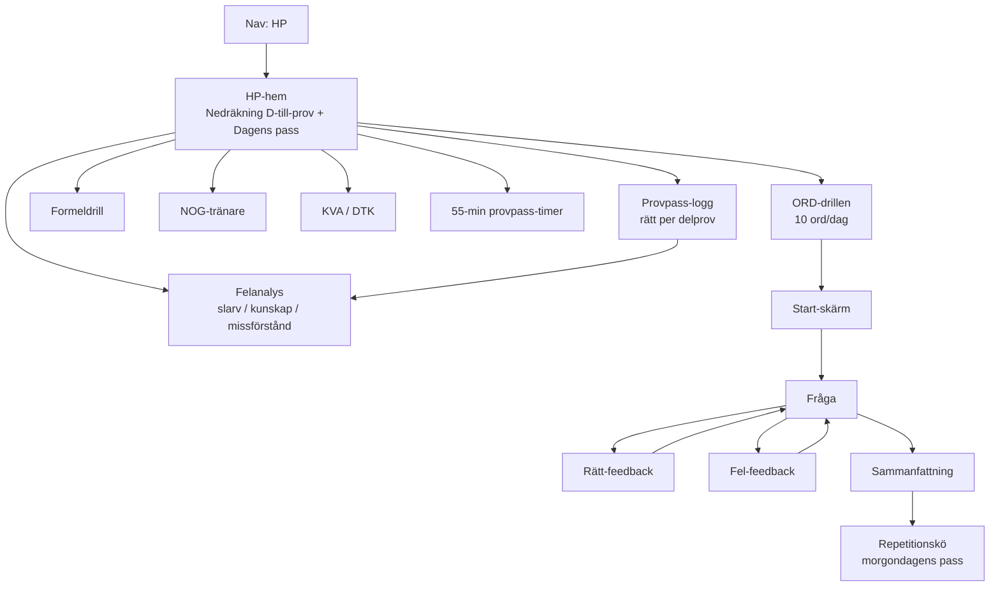

# HP-flik — UX-spec (Högskoleprovet, 18 okt 2026)

_Skapad: 2026-09-24. Status: förslag, väntar på Martins beslut på öppna frågor nedan._

Denna spec beskriver en ny huvudflik "HP" i appen, byggd från grunden inom befintligt designsystem (`docs/DESIGN.md`). Första skärmen som byggs — och testmiljön för hela HP-designspråket — är **ORD-drillen**.

---

## 1. Mål och principer

1. **Tempo är produkten, inte bara innehållet.** Störst research-fynd: tidsbrist är HP:s huvudproblem. Varje ORD-fråga visar målsnitt (~20 s/uppgift) och faktisk tid, så användaren tränar rätt hastighet — inte bara rätt svar. _(Motivering: feedback om prestation mot en tydlig norm förbättrar självreglering — "knowledge of results".)_
2. **Fel svar är input, inte ett nederlag.** Ingen minuspoäng på riktiga HP — så inte heller här. Fel ord läggs automatiskt i en repetitionskö istället för att straffas. _(Motivering: spaced repetition — ord man missar behöver fler exponeringar, inte skam.)_
3. **En tydlig nästa-handling åt gången.** ADHD-anpassning: skärmen visar alltid exakt en primär knapp/åtgärd. Inga parallella vägval mitt i en drill. _(Motivering: val-överbelastning ökar avhopp hos användare med exekutiva svårigheter.)_
4. **Kort och dagligt slår långt och sällan.** ORD-drillen är hårt avgränsad till 10 ord/pass (~3–4 min), inte ett öppet slut. Fler pass går att köra, men varje pass har ett tydligt slut. _(Motivering: research-fyndet "kort daglig drill > långa pass"; korta avgränsade uppgifter sänker startfriktion.)_
5. **Synlig progress hela tiden.** Var i passet man är (t.ex. "ord 4/10"), dagens streak och hur många repetitions-ord som väntar — alltid synligt, aldrig gömt bakom en meny. _(Motivering: extern progressindikator kompenserar för tidsblindhet.)_
6. **Felanalys är värdefullare än poäng.** Varje sammanfattning kategoriserar fel (slarv / kunskap / missförstånd) i stället för att bara visa procent. _(Motivering: research-fyndet att felanalys ger mest lärandeeffekt av allt som testats.)_

---

## 2. Informationsarkitektur — HP-fliken

```mermaid
flowchart TD
    NAV[Nav: HP] --> HOME[HP-hem\nNedräkning D-till-prov + Dagens pass]
    HOME --> ORD[ORD-drillen\n10 ord/dag]
    HOME --> FORMEL[Formeldrill]
    HOME --> NOG[NOG-tränare]
    HOME --> KVADTK[KVA / DTK]
    HOME --> TIMER[55-min provpass-timer]
    HOME --> LOGG[Provpass-logg\nrätt per delprov]
    HOME --> FELANALYS[Felanalys\nslarv / kunskap / missförstånd]

    ORD --> ORDSTART[Start-skärm]
    ORDSTART --> FRAGA[Fråga]
    FRAGA --> RATT[Rätt-feedback]
    FRAGA --> FEL[Fel-feedback]
    RATT --> FRAGA
    FEL --> FRAGA
    FRAGA --> SAMMANFATTNING[Sammanfattning]
    SAMMANFATTNING --> REPKO[Repetitionskö\nmorgondagens pass]
    LOGG --> FELANALYS
```

HP-fliken läggs som en egen post i `pageLabels` / nav-dropdown, jämte Hem/Träna/Prov (samma nav-pill-mönster, se `src/main.ts` `renderNavDropdown`). HP-hem är landningsvyn och länkar vidare till varje delskärm — ingen egen sub-nav, för att undvika ännu en navigeringsnivå ovanpå den redan lappade strukturen.

---

## 3. Skärm för skärm

### 3.1 ORD-drillen (detaljerad)

Datamodell kan följa samma mönster som befintlig `VRSession`/`LSSession` i `src/main.ts` (currentIndex, userAnswer, showFeedback, correct, wrong) — inget nytt sessionskoncept behövs, bara ett nytt ordregister.

**Tillstånd 1 — Start**
- Rubrik: "10 ord idag" + antal ord som väntar i repetitionskön (om >0, visas som egen rad: "+3 repetitionsord från igår").
- En primärknapp: "Starta" (36px action-pill, gradient-primary).
- Ingen konfiguration synlig här — inga val att göra, per princip 3.

**Tillstånd 2 — Fråga**
- Progress: "Ord 4/10" + tunn progress-pip-rad (samma mönster som befintliga track-progress-pips, `--surface-highest`).
- Ordet + 4 svarsalternativ (motsvarar mcq-formatet i `Question`-typen) som fullbredds-knappar, ej pills — samma stil som befintliga mcq-alternativ i bank/mock-vyerna.
- Diskret tempo-indikator: liten klocka/sekundräknare som räknar uppåt mot 20 s-målet (ej nedräkning — nedräkning stressar, uppräkning mot ett riktmärke informerar). Ingen hård timeout.
- Ingen "gissa senare"-knapp — uppmuntrar gissning enligt princip 2 (ingen minuspoäng-koncept ska synas i UI:t: inget "0/1 poäng", bara rätt/fel).

**Tillstånd 3a — Rätt**
- Kort grön (`--ok`) inline-feedback ovanför alternativen, ingen modal, ingen blockering av flödet.
- Alternativet som valdes får `--accent-soft`-bakgrund.
- Auto-advance efter kort delay ELLER en enda "Nästa"-knapp (öppen fråga till Martin, se §6).

**Tillstånd 3b — Fel**
- Samma position, men `--danger`-ton, visar rätt svar direkt under (ingen separat "visa facit"-klick).
- Ordet flaggas tyst för repetitionskön — ingen extra dialog, ingen "vill du öva igen"-fråga (låg friktion).

**Tillstånd 4 — Sammanfattning**
- Stat-widget-mönster (samma som befintliga Score/Streak-siffror): antal rätt av 10, snitt-tempo (t.ex. "18 s/ord — under målet ✓").
- Lista över missade ord, taggade med felkategori om det går att härleda automatiskt (annars manuell taggning som separat läge, se felanalys-skärmen nedan).
- En primärknapp: "Klart för idag" → tillbaka till HP-hem. Ingen "kör igen"-knapp som konkurrerar (håll en tydlig nästa-handling; att köra ett nytt pass är en åtgärd från HP-hem, inte här).

**Tillstånd 5 — Repetition**
- Missade ord dyker upp i morgondagens pass, blandade in bland de 10 nya orden (inte som ett separat "repetitionspass") — lägre friktion, känns inte som straff.
- Om samma ord missas igen: stannar kvar i kön längre (enkel spaced repetition, ingen algoritm-komplexitet i v1).

### 3.2 Övriga skärmar (en rad var, väntar på egen spec)

- **Nedräkning + dagens pass** — HP-hem: "D-24 till HP" + ett kort med dagens föreslagna delmoment (samma logik som `planner.ts`s dagliga plan, men HP-fokuserad).
- **Formeldrill** — samma drillmotor som ORD (fråga → svar → feedback → repetition), bara annat innehåll (formler i stället för ord).
- **NOG-tränare** — flervalsformat men med NOG:s tre-svarsalternativ-logik (tillräcklig info I / II / båda / varken eller) — avviker från standard-mcq, egen komponent.
- **KVA/DTK** — läsförståelse/diagramtolkning, längre uppgifter, troligen kräver bildstöd — ej samma tempo-modell som ORD.
- **Provpass-logg** — tabell/lista: pass-datum, delprov, antal rätt — återanvänder kort-listmönster från befintlig Prov-historik.
- **Felanalys** — aggregat över alla drillar: fördelning slarv/kunskap/missförstånd, filtrerbar per delprov.
- **55-min timer** — fristående verktyg, countdown-widget, troligen egen enkel skärm utan koppling till frågedata.

---

## 4. Komponenter: återanvänt vs nytt

**Återanvänds direkt ur designsystemet:**
- Nav-pill + dropdown-mönster (28px)
- Action-pill 36px för primärknappar (Starta, Klart för idag)
- Stat-widget (siffra 2rem/800, label XS uppercase) — för sammanfattning och streak
- Progress-pips (`--surface-highest`) — för "ord 4/10"
- Kort-komponent (`--card`, ambient shadow, ingen border) — No-Line rule gäller rakt av
- Semantiska färger `--ok` / `--danger` för rätt/fel-feedback
- Track/session-datamönster (`VRSession`/`LSSession`-strukturen) som mall för ny `WordDrillSession`

**Nytt, behöver designas:**
- Tempo-indikator (uppräknande sekundvisare mot ett riktmärke) — finns inget liknande i appen idag
- Repetitionskö-visualisering (hur "väntande ord" kommuniceras diskret på HP-hem)
- Felkategori-tagg (slarv/kunskap/missförstånd) — ny liten tagg-komponent, bör använda befintlig honey/mint-tonpalett snarare än nya färger
- NOG:s fyra-alternativs-logik (I / II / båda / varken eller) — ny svarskomponent

---

## 5. Vad vi lånar från hpappen.se — och varför

- **Sekventiell känsla av "börja här → bygg vidare"** i stället för en platt lista med alla lägen synliga samtidigt — sänker valstress, passar princip 3.
- **Ordträning med automatisk återkomst av fel ord** — exakt samma spaced-repetition-idé som ORD-drillens repetitionskö; bekräftar att mönstret är beprövat för just denna provdel.
- **"Provpass på tid" som eget koncept** snarare än en bieffekt av att svara — motiverar en dedikerad 55-min-timer-skärm i stället för att bara sätta en klocka i hörnet av andra vyer.
- **Resultat per delprov (inte bara totalpoäng)** — motiverar att provpass-loggen bryts ner per delprov från start, inte som en efterhandskonstruktion.

Vi lånar inte: hpappens statistik-tunga "9 miljoner svar"-ramverk (för tungt för v1) eller dess trendbaserade, icke-omedelbara feedback — vår ADHD-anpassning kräver just omedelbar rätt/fel-respons, vilket är en medveten avvikelse.

---

## 6. Öppna frågor till Martin

1. I ORD-drillen: ska rätt-feedback auto-avancera till nästa ord efter en kort delay, eller kräva en explicit "Nästa"-tryckning? (Påverkar tempo-känslan och om det känns för snabbt/stressigt.)
2. Ska tempo-indikatorn (uppräknande sekunder mot 20 s-målet) vara synlig från fråga 1, eller introduceras efter t.ex. dag 3 så nya användare inte känner tidspress direkt?
3. Felkategorisering (slarv/kunskap/missförstånd): ska detta taggas automatiskt (heuristik, t.ex. baserat på svarstid) eller manuellt av dig efter varje missat ord? Automatiskt är snabbare men mindre träffsäkert.
4. Ska HP bli en egen toppnivå-flik i huvudnavet (jämte Hem/Träna/Prov), eller ett underspår under befintliga "Träna"? Det påverkar hur mycket av nuvarande nav som behöver omstruktureras.
5. Var kommer ORD-ordlistan (innehållet, inte UI:t) ifrån — finns den redan någonstans i repot, eller behöver den byggas/importeras som ett separat steg innan skärmen kan fyllas med riktiga ord?

## Beslut (Martin, 2026-09-24)

1. **Rätt svar → valt alternativ grönt + "ord = betydelse" visas ~2 s, sedan auto-nästa** (tryck var som helst för att gå direkt). Motiv: bekräftelsen ska hinna läsas — extra exponering befäster minnet. **Fel svar →** ditt rött, rätt grönt, stannar tills "Nästa".
2. **Tempomätaren (20 s/ord) syns direkt från första frågan.**
3. **Ingen felkategorisering i ORD** — bara i matte-delproven (XYZ/KVA/NOG/DTK).
4. **HP är en egen toppnivå-flik.**
5. **Ordlistan:** målorden hämtas från gamla högskoleprov (studera.nu, UHR) så att typ och nivå blir rätt. Enskilda ord är fria att använda; svarsalternativ, förklaringar och exempelmeningar skriver vi själva — UHR:s uppgifter och HP-appens ordlista kopieras inte.

## Mobile first (krav, 2026-09-24)

Martin tränar mest på mobilen. All HP-design utgår från 375 px bredd och skalas upp — inte tvärtom.

- **Tumzon:** svarsalternativ och "Nästa" i nedre halvan av skärmen, inom tummens räckvidd (Fitts lag). Inga viktiga knappar i övre hörnen.
- **Tryckytor minst 44 × 44 px.** Svarsalternativ som helbreddsknappar staplade vertikalt, 8 px mellanrum så man inte trycker fel.
- **Det viktigaste syns utan scroll på alla HP-skärmar:** nästa handling (t.ex. "Starta dagens pass"), dagar kvar och dagens progress ligger ovanför vecket i 375 × 812. Scroll bara för sekundärt innehåll som historik och statistik.
- **En fråga per skärm, ingen scroll** under drillen. Ordet stort överst, tempomätaren liten under.
- **Ingen hover-beroende info** — allt som visas vid hover på desktop måste synas eller nås med tryck.
- **Tryck var som helst** för att gå vidare efter rätt svar (se beslut 1).
- **Testas i 375 × 812** (mobil-preset) innan något räknas som klart; desktop kontrolleras efteråt.

## Beslut 2026-10-04 (Martins test)

6. **Allt viktigt i första vyn, högst upp.** Fråga och svarsalternativ ligger tätt ihop direkt under topraden, och ingen grupp förankras nedtill. Det ersätter tumzon-regeln för frågevyerna. Tryckytorna är fortfarande minst 44 px.
7. **Hjälpknapp "?" på varje fråga, i alla övningar** (ORD, mattediagnos, matteträning). Mer info hålls bakom knappen så att första vyn förblir ren.
   - Före svar visar den **metoden för delprovet** (t.ex. NOG: testa (1), sedan (2), sedan båda) och **ledtråden för frågan** (`hint`), aldrig svaret.
   - Den öppnas som ett kompakt lager som stängs med ett tryck, och frågan står kvar synlig.
   - Att hjälpen har använts sparas per fråga och visas i sammanfattningen ("3 med hjälp"). Det räknas inte som fel.
   - Efter svar finns lösningen redan i feedbacken, och "?" visar då metoden igen så att den går att lära till nästa gång.

## Beslut 2026-10-05 (förtydligar beslut 7)

8. **Före svar visas bara den allmänna metoden för delprovet** via "?" (aldrig frågans `hint`). Den frågespecifika ledtråden kommer först efter svar, under rubriken **"Så skulle du ha tänkt"** (matte). Motiv: ledtråden avslöjade för mycket innan man försökt själv; efter svar blir den lärande i stället för en genväg.
   - **ORD:** "?" visar bara metoden. Efter svar (rätt och fel) visas "ord = betydelse", förklaringen och **"Så minns du det: …"** (ordets `hint`, ursprung/ordled). Auto-nästa vid rätt svar förlängs till ~3 s eftersom mer text visas; "Tryck för att fortsätta" står kvar.
   - **Matte (diagnos + träning):** feedbacken visar lösningen + "Så skulle du ha tänkt". Vid fel frågas **"Varför blev det fel?"** (Slarv / Kunde inte / Missförstod) i både matteträning och mattediagnos.
   - "?" efter svar visar metoden igen. Beslut 6 gäller: fråga och svar ligger kvar tätt högst upp, feedbacken skjuter inte iväg frågan.

## Beslut 2026-10-05 (2)

9. **Rubrik i varje övning.** En rad (text-sm, centrerad) direkt under topraden: "ORD – ordförståelse", "Mattediagnos" och "Matteträning · NOG – räcker informationen?" (delprovsnamn ur `HP_DELPROV_NAMES`). Motiv: Martin såg inte vad övningen hette. Frågans överkant ligger kvar under 200 px i 375 × 812.
10. **Föregående och Hoppa över i alla tre övningarna** (ORD, mattediagnos, matteträning). En rad direkt under svarsalternativen (efter "Vet inte" i diagnosen): "← Föregående" till vänster, "Hoppa över →" till höger. Synlig pill 28 px, träffyta 44 px via `::after`. Raden ligger högt upp (beslut 6) och är inte svarsgruppens tumzon, så man inte råkar hoppa över när man ska svara.
    - **Föregående** visar föregående besvarade fråga i låst granskningsläge: ditt svar, rätt svar och feedbacken (inga knappar för att svara, ändra felkategori eller gå vidare). Man kan gå flera steg bakåt. Från granskning finns "Tillbaka till aktuell fråga". Inaktiv på fråga 1. Tempomätaren visas inte i granskning och nollställs när man kommer tillbaka.
    - **Hoppa över** flyttar den obesvarade frågan sist i passet, som på riktiga HP. Det räknas inte som fel. När den kommer tillbaka visas "(överhoppad)" i progress. Är frågan redan sist byter knappen text till "Avsluta utan svar →" och avslutar passet; frågan räknas som obesvarad och sammanfattningen visar "Obesvarade: X".
    - Efter svar finns bara "← Föregående"; framåt är den befintliga "Nästa" (eller tryck vid rätt svar i ORD). Tempomätaren nollställs per fråga som förut.

## Beslut 2026-10-05 (3) LÄS-träning

11. **Ett LÄS-pass = en text med dess frågor** (3–4 frågor, 4–10 stycken). Frågan visas först, texten nås med "Visa texten". Rubrik "LÄS – [textens titel]", progress "Fråga 1/4". Texterna väljs så här: repetitionskön (texter där minst en fråga blev fel) först, sedan texter som inte gjorts, sedan den som gjordes för längst tid sedan. Aldrig samma text två gånger i rad. En text lämnar kön först när den görs utan fel.
12. **Fråga ⇄ text är en växlare, inte en panel.** Två lägen med en segmentknapp (28 px, träffyta 44 px) under rubriken: "Frågan | Visa texten" och i textläget "Till frågan | Texten". Motiv: på 375 × 812 går en fråga med fyra alternativ åt ~300 px, och en text på 3 000–5 000 tecken kräver ännu mer, så en delad panel ger en text på ~250 px som man scrollar i en scroll (dålig läsbarhet, fingret fastnar). Växlaren ger hela skärmen åt det man gör just nu och kostar ett tryck. Raden överst (topprad, växlare och i textläget frågans text) är sticky, så man alltid ser tempot, kan byta tillbaka och minns vad man letar efter. Varje vy minns var man var (scrollposition), så "Visa texten" tar en tillbaka till samma ställe. Texten visas som ett kort per stycke med synligt styckenummer, 14 px med radavstånd 1,65 (ca 36–40 tecken per rad).
13. **Tempomätare per text, synlig hela tiden:** "1:12 / 6:00" i toppraden, budget = antal frågor × 2 min (matchar HP-LAS-SPEC §2). Går över budget byter den till `--warm`. Den pausas inte när man läser texten eller granskar en tidigare fråga, för det är samma klocka som på provet.
14. **Efter svar:** rätt/fel markeras. Feedbacken visar `why` för alternativet du valde (vid fel) och för rätt alternativ, alltid. "Se alla alternativ" visar `why` för alla fyra (rätt och ditt val märkta). "Svaret finns i stycke N" med knappen "Öppna stycke N" öppnar texten med det stycket markerat (`--honey`) och scrollat under den sticky raden. Motiv: Martin vill förstå varför han väljer fel, inte bara att han gjorde det. Beslut 6 gäller: fråga och alternativ ligger kvar högst upp, feedbacken ligger under.
15. **"?" före svar visar bara metoden** (de sju LÄS-tipsen), aldrig något frågespecifikt (beslut 8).
16. **Varför blev det fel? (LÄS):** "Missade detalj", "Feltolkade", "Tidsbrist" (valfritt, som i matte). Sparas per fråga och räknas i sammanfattningen.
17. **Sammanfattning per text:** rätt/fel, tid mot budget ("inom budget ✓" eller "X över budget"), felanalys med ett coachande råd för det vanligaste felet, och frågetyper du missade (huvudtanke, detalj, slutsats, syfte, ord i sammanhang). Primärknapp "Nästa text: …".
18. **HP-hem och rekommendation:** kortet "LÄS – läsförståelse" ligger direkt efter "Rekommenderat nu"-blocket, ovanför mattediagnosen och ovanför vecket i 375 × 812. `recommendHpNext` rekommenderar otränat LÄS direkt efter otränade mattedelprov (prioriterat), och därefter en LÄS-text om dagen (en från repetitionskön om sådan finns) efter dagens ord. Resultat och kö sparas i localStorage (`yh.hp-las-result`, `yh.hp-las-repeat`).
19. **Föregående och Hoppa över** fungerar som i beslut 10. En överhoppad fråga flyttas sist i texten; "Avsluta utan svar" på sista frågan avslutar passet.

## Beslut 2026-10-05 (4) Hjälptrappa

20. **Hjälptrappa i mattediagnos, matteträning och LÄS (inte ORD):** Strategi → Ledtråd → nytt försök → Visa svar. Ersätter och förtydligar beslut 7 och 8.
    - **Strategi:** "?" heter nu "Strategi" i alla övningar (även ORD). Allmän metod för delprovet, alltid tillgänglig, aldrig frågespecifik. Pill 28 px, träffyta 44 px. Att den öppnats sparas per fråga och visas som "Strategi öppnad på N frågor".
    - **Ledtråd:** knapp direkt under svarsalternativen. Låst tills ett fel svar eller 30 s har gått på frågan; den låses upp utan omritning så frågan inte flyttar sig (beslut 6). Matte: frågans `hint`. LÄS: "Titta i stycke N" med knappen "Öppna stycke N". I mattediagnosen ersätter den "Vet inte".
    - **Första felet:** rätt svar visas inte. Det valda alternativet markeras fel och inaktiveras, ledtråden visas automatiskt och man försöker igen. **Andra felet** eller **Visa svar** (knappen syns först när ledtråden visats): rätt svar och full feedback som förut (lösning och "Så skulle du ha tänkt"; LÄS: `why` för alla), samt "Varför blev det fel?".
    - **Ärlig räkning per fråga:** "utan hjälp" (rätt första försöket, ingen ledtråd), "med ledtråd" (rätt efter ledtråd eller andra försöket), "visade svar" (inklusive andra felet). Sammanfattningen visar t.ex. "8 utan hjälp · 2 med ledtråd · 1 visade svar". Sparade resultat: `correct` = utan hjälp (statistiken blir inte för snäll), `withHint` sparas separat. Mattediagnosens områdesnivåer räknar bara "utan hjälp" som rätt.
    - **Repetition:** frågor med "med ledtråd" eller "visade svar" läggs i repetitionskön (matteträning per delprov; LÄS per text) och lämnar den först när de klaras utan hjälp (LÄS: när alla frågor i texten klaras utan hjälp). Mattediagnosen har ingen repetitionskö.
    - **Motivering och källor:** låt användaren försöka först, ge hjälp när det behövs men inte före, och bromsa genvägen till facit. Kornell, Hays & Bjork (2009), "Unsuccessful retrieval attempts enhance subsequent learning": misslyckade försök före facit förbättrar inlärningen. Koedinger & Aleven (2007), "Exploring the assistance dilemma in experiments with cognitive tutors": balansen mellan att hjälpa och att låta eleven kämpa. Aleven m.fl. (2016), "Help helps, but only so much": elever som tar hjälp direkt vid svårighet ("hint abuse") lär sig sämre.

## Beslut 2026-10-05 (5) Diagnosnivåer + granskning

21. **Nivå per område i mattediagnosen styrs av utfallet, inte bara rätt/fel.**
    - **Lär om:** någon fråga i området slutade med visat svar (eller fel två gånger), ELLER ingen fråga klarades utan hjälp.
    - **Repetera:** någon fråga krävde ledtråd eller blev fel en gång, eller snittiden är över målet (90 s).
    - **Kan:** alla frågor klarades utan hjälp inom tid.
    - Motiv: "vet inte"/"visade svar" betyder att metoden inte sitter; 1/2 rätt får inte läsas som "nästan kan".
    - Sammanfattningen visar en räkning, "Lär om: 2 områden · Repetera: 3 · Kan: 6", och får aldrig säga att inget behöver läras om när det finns Lär om eller Repetera. Samma rad står på HP-hem under "Se senaste diagnos".
22. **Granskning fråga för fråga.** Per fråga sparas id, område, utfall (clean / hint / shown), valda svar, rätt svar och tid (`HpMathResult.questions`). Resultatskärmen listar områdena Lär om, Repetera först och Kan som expanderbara rader (details/summary, som i guiden). Varje område visar sina frågor med: frågan, ditt svar (flera val visas som "2 → 10"), rätt svar, utfall, lösningen, "Så skulle du ha tänkt" och "Lär dig"-länken till Matteboken. Ett enda Lär om-område är öppet från start; annars visas alla som 44 px-rader så att listan syns utan scroll i 375 × 812. Resultat sparade före detta beslut saknar frågedata: de visar "Gör om diagnosen för att se dina svar fråga för fråga" (och sina gamla nivåer).
23. **HP-hem:** knappen heter "Se senaste diagnos" och öppnar samma resultatvy i efterhand.

## Beslut 2026-10-05 (6) Påminnelsekort

24. **Påminnelsekort: en mobilskärm per typ av problem** (18 kort: 13 mattearea, KVA, NOG, DTK-avläsning, DTK-andel, DTK-förändring). Innehåll: rubrik, formel (framträdande), figur (inline SVG, färg via `currentColor` på `--ink` mot `--card`), "Varför", "Exempel" med steg, "Fällan på provet" och en extern länk "↗" (target=_blank, rel=noopener).
    - **Bara efter svar.** Länken "Påminn mig: [titel]" ligger i feedbacken i matteträning och mattediagnos (efter rätt, "Visa svar" och fel), max två per fråga: områdets kort via `findHpCard(area)` och för tvillingar delprovets strategikort (KVA/NOG/DTK). I diagnosgranskningen ligger "Påminn mig: [titel]" per område bredvid "Lär dig ↗". I guiden finns knappen "Påminnelsekort" som listar alla kort. Inte i Strategi-panelen och aldrig före svar.
    - **Tillbaka** återställer exakt vyn man kom från (feedbacken, granskningen med samma områden öppna och scrollposition, eller guiden). Passet ligger orört i sitt tillstånd. Tempomätaren är redan stoppad efter svar och förblir det medan kortet är öppet.
    - **Motivering:** worked examples (Sweller, Cognitive Load Theory): ett genomräknat exempel lär bättre än att bara få regeln, särskilt för nybörjare i området. Figur och text integrerade (Mayer, split-attention-principen): formeln och bilden står tillsammans så att man inte behöver hålla den ena i minnet medan man söker den andra. Extern länk för den som vill fördjupa sig i video utan att kortet blir långt. Bara efter svar för att inte göra uppgiften lättare (samma resonemang som beslut 8 och 20: försök först, hjälp efteråt).

## Beslut 2026-10-05 (7) Resurser

25. **Sidan "Externa resurser" i HP-fliken.** En sekundär knapp "Externa resurser" på HP-hem (ersätter den lösa studera.nu-länken) öppnar en egen sida med "Tillbaka till HP-hem". Överst en mening, "Kontrollerade 5 okt 2026" (varje länk har `checked`-datum i `src/hp-resources.ts`). Kuraterad lista, 18 länkar i fyra grupper i den ordning man vill GÖRA: Gör gamla prov, Lär dig matten (5 Matteboken-lektioner, resten nås via påminnelsekorten), Strategi och tips, Om provet. Länkar som var döda (404), dubbletter eller ointressanta för Martin släpptes.
    - **Mönster per rad:** gruppens rubrik överst (XS, versaler), sedan kort per länk: titel som länk (beskrivande, aldrig "klicka här") med ↗, en rad förklaring (max ca 90 tecken, dämpad färg, vad man FÅR där) och en kostnadsetikett (gratis, gratis med konto, delvis betalt). Inga tabeller och inga tvåkolumnslayouter. Hela kortet är träffyta (länkens `::after` täcker kortet), 78 px hög, 8 px luft mellan kort, ingen avdelarlinje (No-Line). Länkarna öppnas i ny flik (`target=_blank`, `rel=noopener`) och skärmläsare får "(öppnas i ny flik)".
    - **Motivering:** Information scent: en beskrivande titel plus en rad om vad man får gör att man väljer rätt utan att öppna fliken, vilket sparar uppmärksamhet. Scanning: NN/g:s F-mönster visar att användare läser rubriker och de första orden på rader, så rubrik först, titel först i raden och förklaring och kostnad under i fallande vikt. Ingen tabell eftersom en kolumn på 375 px läses i en rörelse. Kostnaden syns i förväg så att konto- och betalväggar inte blir en överraskning.
    - **Källor:** NN/g, "F-Shaped Pattern of Reading on the Web" (https://www.nngroup.com/articles/f-shaped-pattern-reading-web-content/): rubriker och inledande ord, listor, och att mönstret gäller även mobil. GOV.UK Design System, "Links" (https://design-system.service.gov.uk/styles/links/): länktext ska vara meningsfull och ange externa länkar, och nya flikar ska annonseras i länktexten med `rel=noopener`. W3C WCAG 2.2 SC 2.5.8 Target Size (https://www.w3.org/WAI/WCAG22/Understanding/target-size-minimum.html): minst 24 px och avstånd mellan mål; vi håller de egna 44 px och 8 px. (Nielsens och GOV.UK:s sidor om "related links" och list-mönster gick inte att hämta, 404, och citeras därför inte.)
